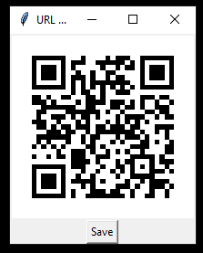

# url to qr code

## what does it do
It watches your Windows clipboard for a url, then automatically imports it and generates a qr code for it.

for u/tavernphil on reddit

## how to install
either download from the releases tab on the right 

or
- git clone
- pip install -r requirements.txt
- python main.py

## other things
built into an exe using pyinstaller

hopefully not too jank. lol.